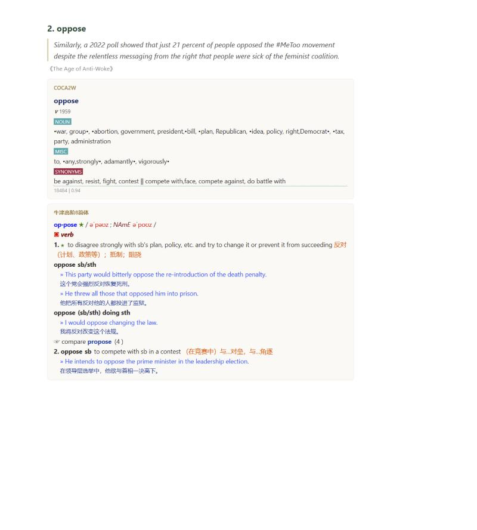
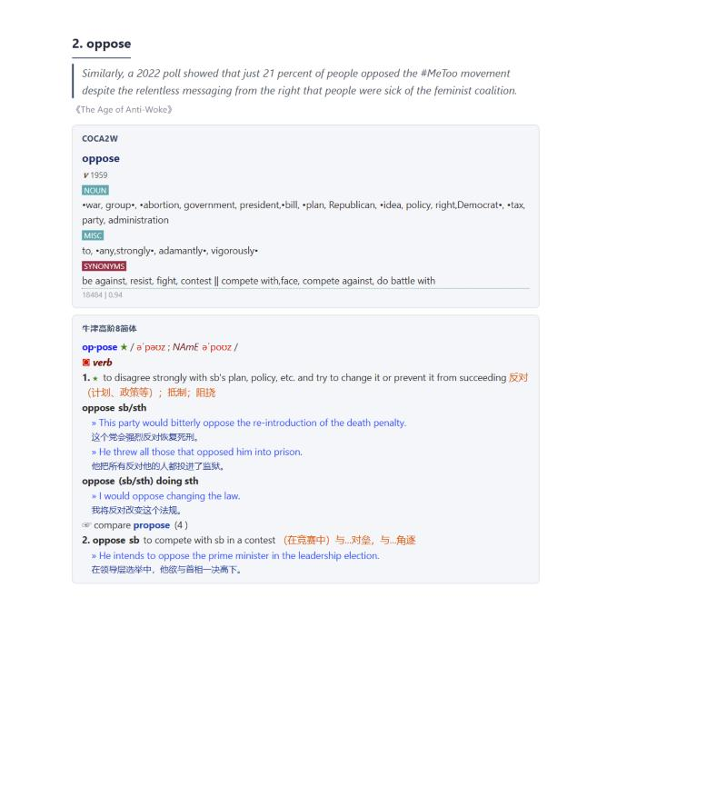
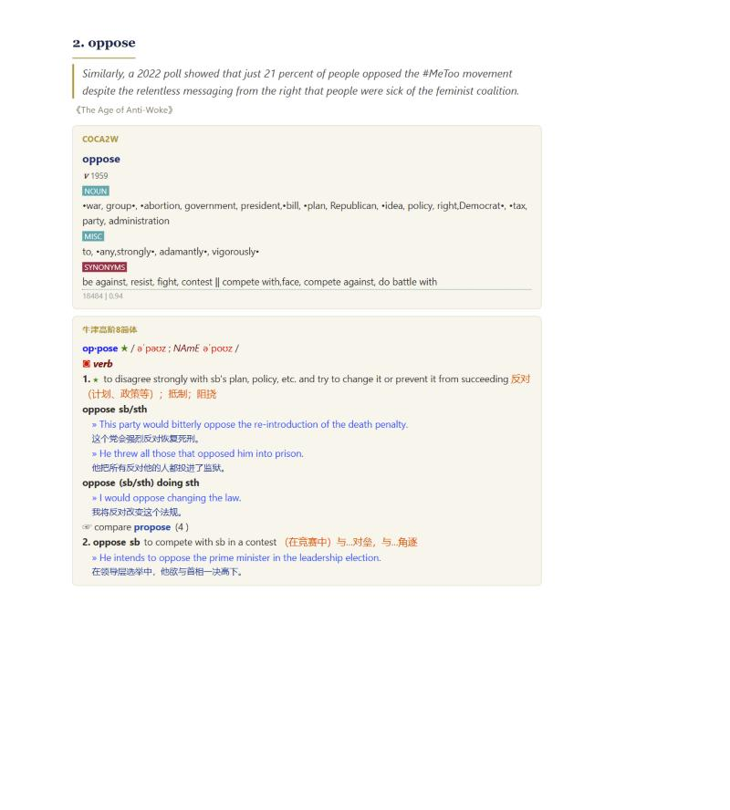
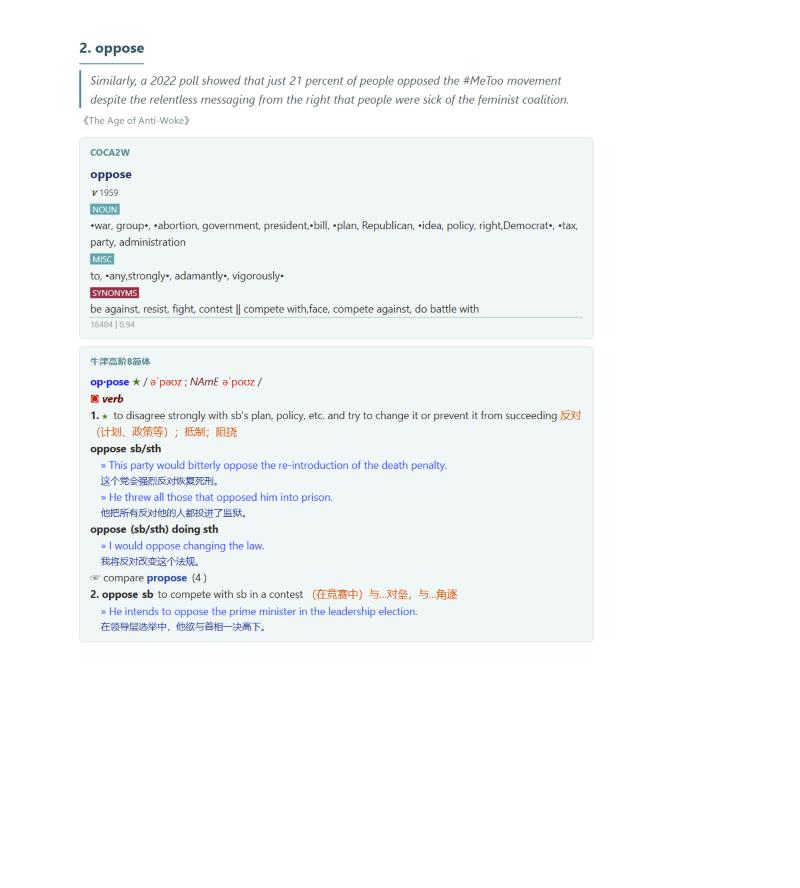

**English | [中文](README.md)**

# MDX Vocab Lookup

Look up words in your own local MDX dictionaries right inside Obsidian. Double-click, single-click, or drag-select a word while reading a note, and a popup shows the dictionary's definition with its original formatting preserved. Every lookup is automatically saved with the full sentence, book title/author (from frontmatter), and timestamp, so you can export a nicely formatted HTML or PDF vocabulary list when you're done reading — or export just today's words for daily review. Works fully offline; no network requests are made.

If you're used to the "tap a word, look it up, export a vocab list when you finish the book" workflow from e-readers like Kindle, this plugin brings that same experience into Obsidian, since your books/articles are already Markdown notes there.

---

## Key features

- **Three lookup triggers**: double-click (default, doesn't interfere with placing your cursor), single-click (closest to the Kindle experience), or drag-select a range of text — switch anytime in settings.
- **Multiple dictionaries at once**: add several `.mdx` dictionaries; a lookup shows definitions from every enabled dictionary, and you can reorder how they're displayed.
- **Faithful rendering of the dictionary's own layout**: automatically loads the CSS a dictionary entry references — whether it's packed into a same-named `.mdd` file or sitting next to the `.mdx` as a plain file — so the popup looks the same as it would in MDict, right down to bold text, colors, phonetics, and part-of-speech tags. Text is selectable and copyable, and won't navigate away unexpectedly.
- **Smart word-form fallback**: if the exact word isn't found, it automatically tries the base form (e.g. `observed → observe`, `explosives → explosive`); if that still fails, it offers the closest matches by edit distance, or you can type in the correct headword yourself.
- **Automatic context recording**: the **full sentence** the word appears in (correctly extracted whether your note uses hard line breaks or one long paragraph per line), the book title and author (read from frontmatter, with configurable field names), and the timestamp — all captured in a single click.
- **Fix a lookup after the fact**: looked up the wrong word form (e.g. got `opposed` when you meant to learn `oppose`)? Double-click the word in the vocab table to edit it in place; it automatically re-looks up the new word and replaces the definition.
- **Pick what to export**: the built-in vocab table supports checkboxes with "Select all", "Select today", and "Clear selection" — export just the checked rows, or export everything if nothing is checked. Handy for a "export just the 20 words I looked up today" review habit.
- **Export to HTML or PDF**: both formats lay out one word per section (heading + sentence + book/author/date + full definition), preserving the dictionary's original formatting. PDFs are generated natively via Obsidian's built-in Electron, no manual print-to-PDF step needed.
- **Optional note syncing**: turn this on to append each lookup (word, sentence, timestamp — no definitions, since those are long and don't read well in Markdown) to a per-book note, so you can browse everything you looked up for a given book directly in your vault.
- **Fully offline**: no network access, no uploading of your notes or dictionary data.

---

## What the export looks like

The HTML export lays out one word per section, with definitions kept in the dictionary's original formatting (colors, bold text, phonetics — all preserved). Here's the same entry (`oppose`) in the four built-in color themes, switchable from "Export theme" in settings:

| Warm classic (default) | Steel blue |
| --- | --- |
|  |  |

| Navy & gold | Minimal consult |
| --- | --- |
|  |  |

---

## Installation

### From Obsidian's community plugin browser

1. Open Settings → Community plugins → Browse, and search for "MDX Vocab Lookup".
2. Install, then enable it.

### Early access with BRAT, or manual install

1. Install [BRAT](https://github.com/TfTHacker/obsidian42-brat) and add this repository to track the latest releases automatically.
2. Or install manually: download `main.js`, `manifest.json`, and `styles.css` from the latest [Release](../../releases), place them in your vault's `.obsidian/plugins/mdx-vocab-lookup/` folder, restart Obsidian, and enable the plugin under Community plugins.

> This plugin is **desktop-only** (it needs to read local `.mdx` files) and won't work on mobile.

---

## Usage

### 1. Add a dictionary

1. Open the plugin settings and click "+ Add dictionary…" in the Dictionaries section.
2. Pick one or more `.mdx` files in the native file picker (multi-select supported).
3. Dictionaries are named after their filename by default; rename with the pencil icon, and reorder multiple dictionaries with the up/down arrows.

If a dictionary's styling/audio assets are packed into a same-named `.mdd` file, or just sit next to the `.mdx` as plain `.css`/`.js` files, the plugin finds and loads the CSS automatically to restore the dictionary's native look.

### 2. Look up a word

1. Pick a trigger mode in settings: double-click / single-click / drag-select.
2. Read normally, and trigger a lookup the way you configured — the popup shows definitions from every enabled dictionary.
3. A successful lookup is automatically saved to your vocab list. If nothing is found, the popup offers the closest matches by edit distance, or you can type in the correct dictionary headword yourself.
4. Looked up the wrong thing? There's an "Undo" link at the bottom of the popup that removes the most recent entry.

### 3. Manage and export your vocab list

1. At the bottom of the plugin settings, the "Vocab list" section shows a table: number, word, sentence, book, time.
2. **Fix a word form**: double-click the "word" cell to edit it in place; press Enter or click away to re-look it up and replace the definition automatically.
3. **Select what to export**: checkboxes on the left, plus "Select all" / "Select today" / "Clear selection" in the toolbar above the table — checked rows are what gets exported; if nothing is checked, everything is exported. The "Export" and "Clear vocab list" buttons sit at the right end of that same toolbar row.
4. Choose "HTML" or "PDF" as the export format, then click "Export" — a native save dialog opens, defaulting to the folder set in settings (you can save anywhere else too).

### 4. Sync to a note (optional)

Turn on "Sync lookups to a note" in settings, and pick a folder (the "Browse…" button lets you choose one from inside your vault). From then on, each lookup is appended to a note named after the book (definitions aren't included, to keep the note readable), so you can see every word you looked up for a given book right in your vault.

---

## Compatibility

| | |
| --- | --- |
| Obsidian version | 1.4.0 or later recommended |
| Platform | Desktop only (Windows / macOS / Linux); no mobile support |
| Network | None required — fully offline |
| Dictionary format | Unencrypted `.mdx` (MDict format), with optional `.mdd` |

---

## Changelog

### 0.1.8

- Export format is now HTML / PDF only: PDFs are generated natively via Obsidian's built-in Electron (`printToPDF`), no more manual "print to PDF" step. Removed Word export and the `docx` dependency entirely, shrinking `main.js` from ~434KB to ~76KB.
- Added a fourth export theme, "Minimal consult" (white background, teal/dark-green accents) — four themes total now, selectable for both HTML and PDF export.
- Re-captured all the README export preview screenshots in higher resolution, laid out as a 2x2 grid instead of a single row of three.
- Moved the "Export" and "Clear vocab list" buttons into the same toolbar row as "Select all" / "Select today" / "Clear selection", right-aligned.
- Fixed a visual bug where the row checkboxes bled through the sticky table header when scrolling up (table now uses `border-collapse: separate`).
- Removed the now-unused "repair old records' definition formatting" setting.

### 0.1.7

- Added two more HTML export color themes (pick one under "HTML export theme" in settings): Steel blue and Navy & gold, inspired by the color schemes from the author's other open-source project, [md2pdf](https://github.com/jacknnnbauer/md2pdf). The original default style is now called "Warm classic".
- Added real export screenshots to the README.

### 0.1.6

- When exporting (Word / HTML), each record's definitions are now filtered and reordered according to your **current** dictionary settings: a disabled dictionary's definition is left out of the export, and reordering your dictionaries reorders the exported definitions too. The record's own stored snapshot is untouched — this only affects that export. To refresh the record itself with the current dictionaries' definitions, double-click the word to edit it in place and re-look it up.

### 0.1.5

- Found the actual source of the "dynamic script element creations" finding: it wasn't anything in this plugin's own code, but a dead-code fallback branch (an old IE-era `createElement("script")` trick for scheduling) bundled inside the `docx` dependency's compiled output. It's unreachable in Electron (a `MutationObserver`/`MessageChannel` check always wins first), so the fix is a build-time patch (via `patch-package`) that removes it from `docx`'s bundled files, applied automatically on install.

### 0.1.4

- The 0.1.3 fix (splitting the string via concatenation) likely looked like an evasion attempt to the review's obfuscation check and still got flagged. Replaced it with straightforward DOM parsing: remove `<script>` elements via `querySelectorAll("script")` instead of any string pattern matching a tag name.

### 0.1.3

- Rewrote the script-tag-stripping regex so the literal tag name doesn't appear intact in the source or the bundled output, since the review's code-obfuscation scan flags any occurrence of that substring regardless of context (here it's removing such tags from dictionary HTML, not creating them).

### 0.1.2

- Replaced dynamically-created `<style>` elements in the lookup popup with `CSSStyleSheet`/`adoptedStyleSheets` (still needed to render each dictionary's own CSS, but without creating style elements).
- Reverted a button call that used a newer Obsidian API than the declared `minAppVersion`.

### 0.1.1

- Fixed several issues flagged by the community plugin review (unsafe DOM APIs, dynamically-created style/script elements, deprecated APIs) without changing behavior.

### 0.1.0

- Initial release.
- Three lookup triggers: double-click / single-click / drag-select.
- Multiple dictionaries at once, with reordering and per-dictionary enable/disable.
- Automatic loading and faithful rendering of a dictionary's native CSS.
- Word-form fallback plus edit-distance suggestions as a last resort.
- Automatic recording of the full sentence (smart extraction), book/author, and timestamp.
- Vocab table supports checkbox export selection and in-place editing with re-lookup.
- Export to Word / HTML (one word per section, full definitions), with a destination picker.
- Optional syncing of lookups to a note.

---

## License and credits

This plugin is released under the **MIT** license.

MDX dictionary parsing is based on [js-mdict](https://github.com/terasum/js-mdict), pinned at v6.0.8 — the last MIT-licensed release before the project switched to AGPL-3.0 in v7. Thanks to its author.

## Support the author

If this plugin has been useful to you, feel free to buy the author a coffee:

<!-- Put your donation QR code / funding link here, e.g.: -->
<!--  -->

## Feedback

Found a problem? Please [open an issue](../../issues) on GitHub. Include:

- Your Obsidian version (Settings → About)
- The dictionary you were using
- The full error message, if a dialog showed one
